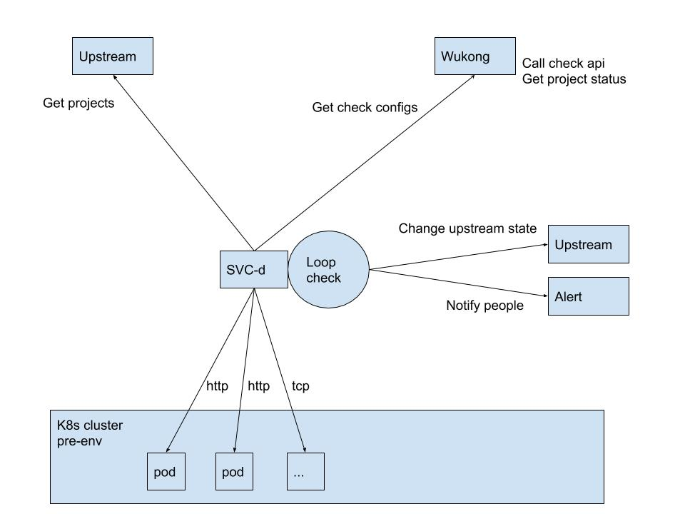

# SVC-d

服务治理

## Arch




### Checker

| type | struct | demo |
| ---- | ------ | ---- |
| http |        |      |
| tcp  |        |      |

### Example data

{

  Project: example

  Region: M7

  httpchecker: 

  tcpchecker: 

}

#### HTTPChecker

```json
(checkup.HTTPChecker) {
 Name: (string) (len=7) "Website",
 URL: (string) (len=20) "http://www.baidu.com",
 UpStatus: (int) 0,
 ThresholdRTT: (time.Duration) 0s,
 MustContain: (string) "",
 MustNotContain: (string) "",
 Attempts: (int) 5,
 AttemptSpacing: (time.Duration) 0s,
},
```


#### TCPChecker

```json
(checkup.TCPChecker) {
 Name: (string) (len=4) "tcp1",
 URL: (string) (len=18) "220.181.111.188:80",
 Timeout: (time.Duration) 0s,
 ThresholdRTT: (time.Duration) 0s,
 Attempts: (int) 5
}
```

#### Result Notify

```json
   Notifier: (checkup.Qianbao) {
    Name: (string) (len=6) "qianbao",
    Username: (string) "",
    Channel: (string) (len=8) "http://notify-url",
    Webhook: (string) ""
   }
```

there will be a notify servicec? it's may just itself ( call itself's api )

## Install

Download release tar file

> change start parameter accordingly

## Update

./update-svc-d.sh

